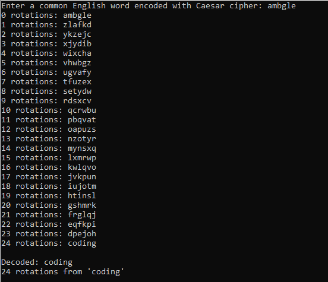

# Caesar cipher Decoder and Encoder
Here is an implementation of a Caesar Cipher decoding and encoding algorithm.

Given an encoded English word (input), the algorithm applies rotations on it until a rotated version of the encoded word is found in the dictionary folder **OR** until it reaches 26 rotations, at which point, it means there are no decoded versions that are English words from our dictionary.

  
There is also an encoder algorithm that applies a random amount of rotations on an inputted English word to give an encoded one.
